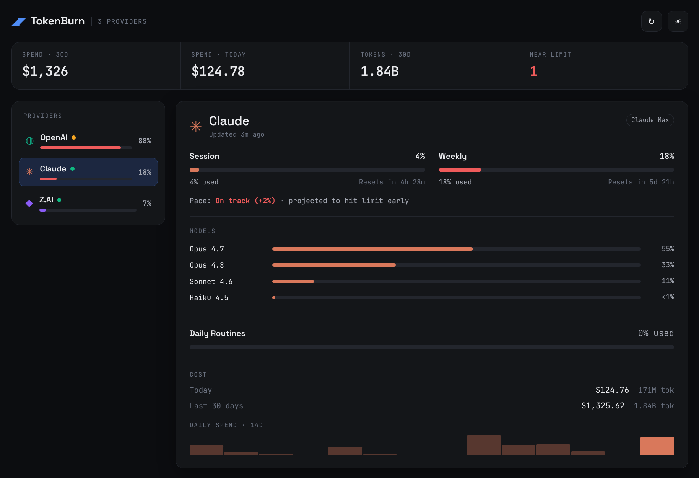

# TokenBurn

A web-baased usage meter and api to visualise how fast you are burning through your ai tokens. Under the hood it
uses codexbar-cli to get the data, this is baked into the codexbar-api docker container with an api wrapped 
around it. Then we have a pretty web ui to see the numbers.



## Services

### codexbar-api

A Docker container that runs the [codexbar](https://github.com/steipete/codexbar) Linux CLI
and exposes AI-provider usage/cost data as an authenticated, cached HTTP API with Prometheus
metrics.

#### Endpoints

| Method | Path | Auth | Description |
|--------|------|------|-------------|
| GET | `/healthz` | none | Liveness |
| GET | `/metrics` | none | Prometheus metrics |
| GET | `/v1/usage` | Bearer | Reshaped usage, `?provider=` filter |
| GET | `/v1/cost?days=30` | Bearer | Reshaped cost (days 1-365) |
| GET | `/v1/summary?days=30` | Bearer | Combined usage+cost per provider |

Auth: `Authorization: Bearer $API_TOKEN`. All `/v1/*` requests accept an optional `?provider=`
filter and return a `{ generatedAt, cached, providers[] }` envelope.

**Full API reference:** [`docs/API.md`](docs/API.md) — request params, response schemas, status
codes, and examples.

#### Quick start

```bash
cp .env.example .env      # set API_TOKEN (+ any API-key providers)
# Ensure you're logged in on the host: `claude setup-token` and `codex` login.
docker compose up -d      # pulls published jez500 images; mounts ~/.claude and ~/.codex
curl -H "Authorization: Bearer $API_TOKEN" localhost:3033/v1/summary
```

Two compose files are provided:

- **`docker-compose.yml`** (default) — runs the published Docker Hub images
  (`jez500/codexbar-api`, `jez500/tokenburn-webui`). No build step. Pin a version with
  `TAG=0.1.0 docker compose up -d` (defaults to `latest`); `docker compose pull` to update.
- **`docker-compose.dev.yml`** — builds both images from source:
  `docker compose -f docker-compose.dev.yml up --build`.

### Web UI (TokenBurn)

A second image (`webui/`) serves **TokenBurn**, a responsive dashboard for the usage/cost data.
It adapts to the viewport — a **Grid** of provider cards on mobile (≤768px) and a sidebar
**Console** with a detail panel on desktop — with dark/light mode, 60-second auto-refresh plus a
manual refresh button, and is **installable as a PWA** (web app manifest + service worker).

```bash
docker compose up -d              # starts both codexbar-api and webui
open http://localhost:8080        # the dashboard
```

The web container never exposes your `API_TOKEN` to the browser — it proxies `/api/summary`
to `codexbar-api` server-side and injects the bearer token. Configure via env:

| Var | Default | Purpose |
|-----|---------|---------|
| `API_BASE_URL` | `http://codexbar-api:3000` | Upstream API base URL |
| `API_TOKEN` | (from `.env`) | Bearer token for the upstream API |
| `PORT` | `3000` | Web server port inside the container (host `8080` via compose) |

Behavior worth knowing:
- **Unconfigured providers are hidden.** A provider that errors (missing API key, not logged in)
  is dropped from the dashboard; if none are reachable, a setup-help screen explains how to add
  credentials. The brand shows the count of configured providers.
- **Sections render only when data exists.** A provider with no local cost logs shows a short
  "No local cost data" note instead of a spend chart/breakdown (codexbar reads cost from
  Claude/Codex CLI logs only — see the Codex note under Configuration).

#### Configuration

Two credential models, used together:

**OAuth subscription plans (Claude Code Pro/Max, OpenAI Codex/ChatGPT)** — no API key.
Log in once on the host (`claude setup-token` and `codex` login), then mount the host
credential dirs read-write. `docker-compose.yml` mounts `~/.claude` and `~/.codex` into the
container, which runs as **uid 1000** (the base image's `node` user) so it can read and
refresh those `600`-mode files. This requires the host user to be uid 1000.

- Usage is fetched with `--source oauth`; tokens self-refresh and persist back to the host
  files. `/v1/usage` and `/v1/summary` report each plan's percent-used and reset windows.
- Cost (`/v1/cost`, `/v1/summary`) is **only available for Claude and Codex** (codexbar reads
  local native logs) over a fixed ~30-day window. The `?days=` query param is accepted for
  compatibility but does not change codexbar's window. Codex cost/tokens are derived from the
  **Codex CLI** session logs in `~/.codex/sessions`, so they only appear if you've used the
  Codex CLI locally within that ~30-day window — usage through the Codex cloud/IDE doesn't write
  those logs, in which case Codex cost comes back null even though its usage limits still report.
- `CODEXBAR_OAUTH_PROVIDERS` (default `claude,codex`) decides each provider's auth mode:
  providers in the list use the OAuth/mount path; others use the API-key path.
- If Claude ever returns a `user:profile` scope error, run `claude setup-token` on the host to
  mint a scoped token.

**API-key providers** — set the matching env var (`GEMINI_API_KEY`, `ZAI_API_KEY`, or the
`OPENAI_ADMIN_KEY`/`ANTHROPIC_ADMIN_KEY` admin keys). These are provisioned via
`codexbar config set-api-key` at boot and queried with `--source api`. To use admin keys for
codex/claude, remove them from `CODEXBAR_OAUTH_PROVIDERS`.

See `.env.example` for the full list.

## Container images & releases

CI (`.github/workflows/ci.yml`) runs the test suites and builds **both** images on every push
and PR. On a version tag (`v*`), it builds multi-arch (`amd64` + `arm64`) and **pushes to Docker
Hub**:

- `docker.io/<DOCKERHUB_USERNAME>/codexbar-api`
- `docker.io/<DOCKERHUB_USERNAME>/tokenburn-webui`

Tagged `:{version}`, `:{major}.{minor}`, and `:latest`.

**One-time setup** — add two repository secrets (Settings → Secrets and variables → Actions):
`DOCKERHUB_USERNAME` and `DOCKERHUB_TOKEN` (a Docker Hub access token with write scope).

**Cut a release:**

```bash
git tag v0.1.0
git push origin v0.1.0    # triggers the build-and-push
```

## Security notes

- `/v1/*` requires the bearer `API_TOKEN` (constant-time compared). `/healthz` and `/metrics`
  are **unauthenticated** by design (liveness probe + Prometheus scraper). `/metrics` exposes
  per-provider cost/usage gauges, so **don't publish the API port to an untrusted network** —
  keep it on a private network or behind a reverse proxy / scraper-only ACL.
- The web UI keeps `API_TOKEN` server-side; the browser only talks to the web container's
  `/api/summary`.
- The host credential dirs (`~/.claude`, `~/.codex`) are mounted read-write because codexbar
  refreshes OAuth tokens in place; the container runs as a non-root user (uid 1000).
- Never commit your real `.env` (it's gitignored). Rotate any key that has been shared.

## Development

```bash
npm install
npm test                  # runs against a stub codexbar binary, no creds needed
./scripts/smoke.sh        # build + boot + curl assertions
```

## Testing with Postman

A ready-to-use collection lives in [`postman/`](postman/): import
`codexbar-api.postman_collection.json` and `codexbar-api.postman_environment.json`, set
`api_token` to your `API_TOKEN`, and send requests (or run the whole collection with the
Collection Runner — each request carries test assertions). See [`postman/README.md`](postman/README.md).
